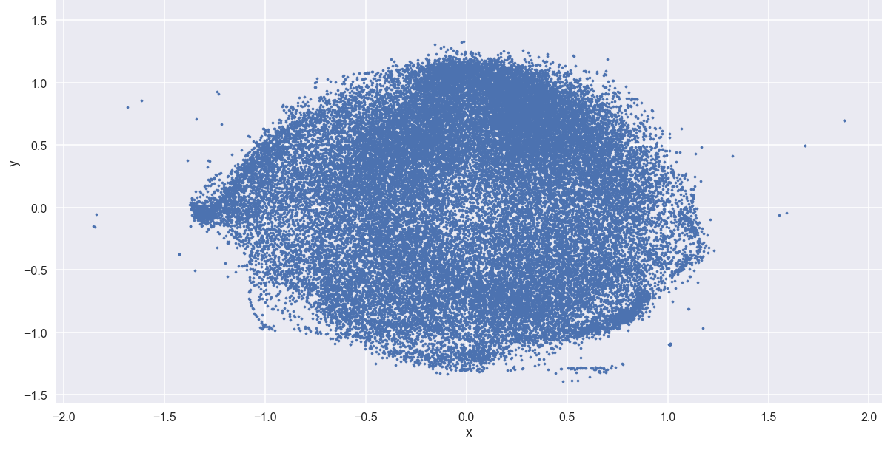

# Lex2Vec



O Lex2Vec consiste no treinamento de um modelo [word2vec](https://www.tensorflow.org/tutorials/word2vec) (Continuous Bag-of-Words - CBOW e Skip-Gram) para gerar representações vetoriais de termos presentes no _corpus_ da legislação federal brasileira. Para treinar o modelo foram utilizadas normas federais promulgadas entre 1824 a 2017 (pouco mais de 230 mil normas), extraídas do Sistema de Legislação Informatizada da Câmara dos Deputados.


## Aplicações potenciais

Obter uma representação vetorial das palavras poder ser útil em vários cenários, tais como:

* Classificação de textos por temas
* Sugestão de textos relacionados
* Busca conceitual


## Estatísticas do corpus:

* 233.108 normas
* 1.022.475.208 caracteres
* 6.731.894 sentenças
* 43.245 palavras únicas no vocabulário (utilizando apenas termos com no mínimo 50 ocorrências)


## Explorando o modelo pré-treinado

Este repositório contém um modelo pré-treinado com um vocabulário de 43.245 termos e vetores de 300 dimensões. O modelo consegue capturar relações semânticas interessantes de modo não supervisionado, demonstradas nos seguintes exemplos:


### Carregando o modelo

```
import os
import gensim.models.word2vec as w2v

model_name = "300features_50minwords_10context.w2v"
lex2vec = w2v.Word2Vec.load(os.path.join("save", model_name))
```

### Encontrando termos similares

```
lex2vec.most_similar("EMBRATEL")
```

```
Resultado:

[('TELEBRAS', 0.46656790375709534),
 ('TELESP', 0.42777448892593384),
 ('TELEMIG', 0.38827258348464966),
 ('ANATEL', 0.35730618238449097),
 ('Belgo', 0.3498556613922119),
 ('repetidora', 0.34687942266464233),
 ('Infraero', 0.34304380416870117),
 ('gerados', 0.34097760915756226),
 ('Anatel', 0.3390734791755676),
 ('Empresa', 0.33874088525772095)]
```

```
lex2vec.most_similar("Vargas")
```

```
Resultado:

[('Getulio', 0.6636236906051636),
 ('Venceslau', 0.6010723114013672),
 ('Prudente', 0.5858972072601318),
 ('Bernardes', 0.5719530582427979),
 ('Olegario', 0.5560286045074463),
 ('VargasJoao', 0.5533983707427979),
 ('Medici', 0.5531241297721863),
 ('Kennedy', 0.5413193702697754),
 ('Epitacio', 0.5351393222808838),
 ('Wenceslau', 0.5198877453804016)]
```

### Relações lineares entre pares de palavras

```
def nearest_similarity_cosmul(start1, end1, end2):
    similarities = lex2vec.most_similar_cosmul(
        positive=[end2, start1],
        negative=[end1]
    )
    start2 = similarities[0][0]
    print("{start1} is related to {end1}, as {start2} is related to {end2}".format(**locals()))

nearest_similarity_cosmul("deputado", "camara", "senado")
nearest_similarity_cosmul("Lula", "Presidencia", "Senado")
nearest_similarity_cosmul("Aracaju", "Sergipe", "Ceara")
```

```
Resultado:

deputado is related to camara, as senador is related to senado
Lula is related to Presidencia, as CALHEIROS is related to Senado
Aracaju is related to Sergipe, as Fortaleza is related to Ceara
```

### Termos que não se encaixam no contexto

```
lex2vec.doesnt_match("educacao saude constituicao seguranca".split())
```

```
Resultado:

'constituicao'
```

### Visualizando termos em duas dimensões

Este respositório também contém uma versão em duas dimensões (gerados a partir da técnica [t-SNE](https://lvdmaaten.github.io/tsne/)) dos vetores.

```
import pickle
all_word_vectors_matrix_2d = pickle.load(open("save/tsne.p", "rb"))
print(all_word_vectors_matrix_2d)
```

```
Resultado:

array([[ 0.83291635,  0.55043252],
       [ 0.81828285,  0.46835479],
       [ 0.55110239,  0.41292966],
       ..., 
       [-0.50291671,  0.00188557],
       [ 0.61131678, -0.20737014],
       [ 0.4973536 ,  0.76736404]])
```

Veja mais detalhes sobre como visualizar os vetores [aqui](./lex2vec.ipynb).

## Como treinar um modelo word2vec?

Os detalhes do treinamento estão descritos [aqui](./lex2vec.ipynb).

### Requisitos de hardware

* 16GB de RAM para treinar o modelo word2vec
* 32GB de RAM para redução de dimensionalidade usando [t-SNE](https://lvdmaaten.github.io/tsne/)


## Referências

* [Efficient Estimation of Word Representations in Vector Space](https://arxiv.org/abs/1301.3781)
* [Tensorflow - Vector Representations of Words](https://www.tensorflow.org/tutorials/word2vec)
* [Kaggle - Bag of Words Meets Bags of Popcorn](https://www.kaggle.com/c/word2vec-nlp-tutorial/details/part-2-word-vectors)
* [Thrones2Vec tutorial](https://github.com/YuriyGuts/thrones2vec)
* [word2vec tool by Google](https://code.google.com/archive/p/word2vec/)
* [gensim - Deep learning with word2vec](https://radimrehurek.com/gensim/models/word2vec.html)
* [Natural Language Toolkit - NLTK](http://www.nltk.org/)
* [t-Distributed Stochastic Neighbor Embedding (t-SNE)](https://lvdmaaten.github.io/tsne/)
